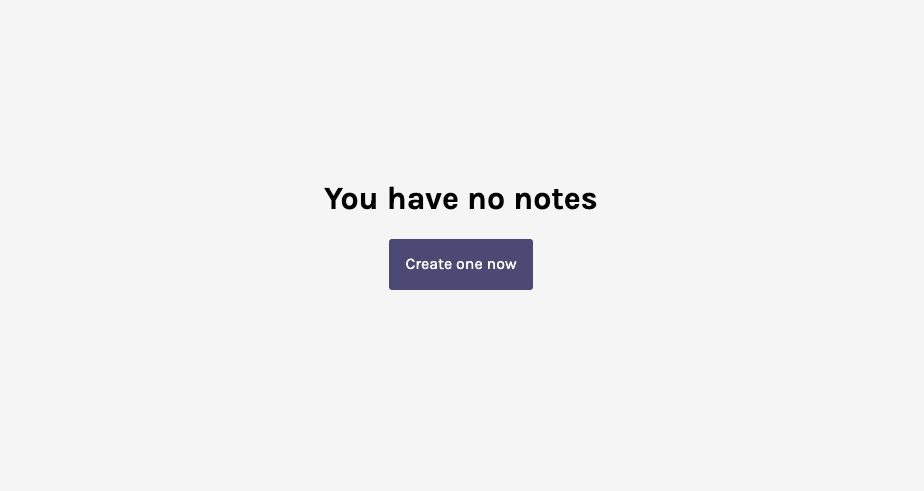
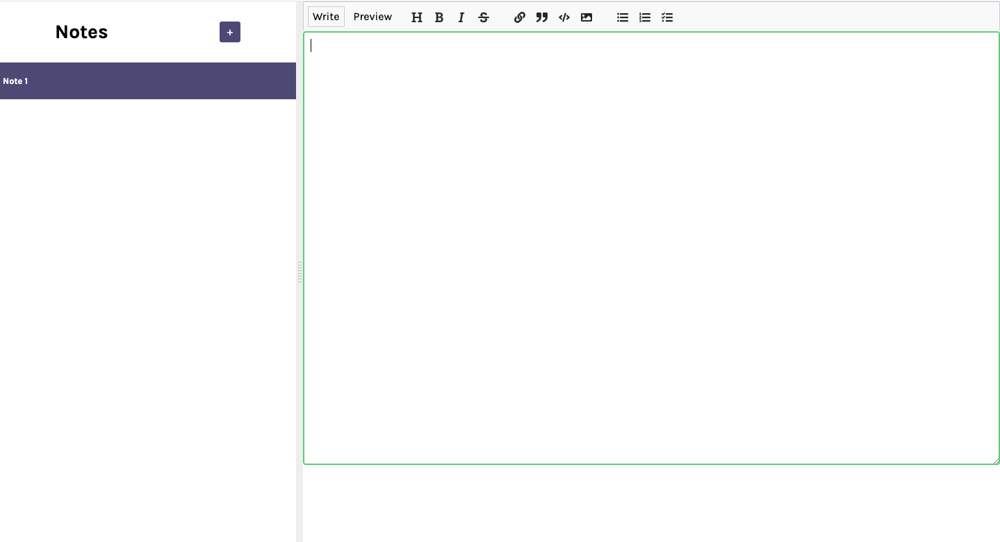

## About the Project

# React Markdown Editor

This is a markdown editor Project, built with React and key dependencies like nanoid, react-mde, react-split, and showdown, offers a dynamic and feature-rich environment for Markdown content creation. Elevate your content editing experience with this innovative use of React and versatile dependencies.


## Table of contents

- [Overview](#overview)
  - [Screenshots](#screenshots)
  - [Live view](#links)
- [Process](#my-process)
  - [Built with](#built-with)
  - [What I learned](#what-i-learned)
  - [Continued development](#continued-development)
  - [Useful resources](#useful-resources)
- [Author](#author)
- [Acknowledgments](#acknowledgments)

## Overview

### Screenshots




### Links

- Live Site URL: [Click here](https://657d1dad1d85b869004391e5--inquisitive-fox-a9af33.netlify.app/)

## Process

### Built with

- Semantic HTML5 markup
- Basic CSS and Flexbox
- Flexbox
- [React JS](https://reactjs.org/) - JS library
- [React Split](https://www.npmjs.com/package/react-split) - library
- [React MDE](https://www.npmjs.com/package/react-mde) - library
- [Showdown converter](https://www.npmjs.com/package/react-showdown) - library

### Things learnt

- Handling of input values with React
- Use of certin dependencies to enhance the project functionality

### Continued development

- Adding responsiveness
- Update UI

### Useful resources
- [React forms documentation](https://react.dev/reference/react-dom/components#form-components)
- [React State](https://react.dev/learn/state-a-components-memory)


## Acknowledgments

I would be glad if you can leave out some suggestion on how I can improve my code.


## Quick start:

```
$ yarn # npm install
$ yarn build # npm run build
````

## Development

Run Webpack in watch-mode to continually compile the JavaScript as you work:

```
$ yarn watch # npm run watch
```
